# Customer Management System

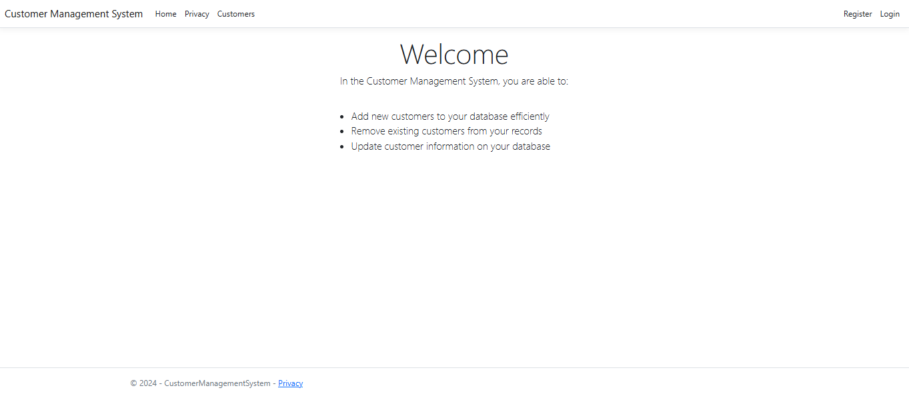

## 🚀 About

The **Customer Management System** is a comprehensive web platform that enables business owners to efficiently manage their customer information through full CRUD (Create, Read, Update, Delete) operations. Built with ASP.NET Core MVC and Entity Framework, this application provides a robust and scalable solution for customer data management.

### Key Objectives
- Provide intuitive customer data management
- Ensure secure user authentication and authorization
- Deliver responsive and user-friendly interface
- Maintain data integrity and security

## ✨ Features

### Customer Management
- ✅ **Create new customers** with complete information
- ✅ **View customer details** in organized layouts
- ✅ **Edit existing customer** information
- ✅ **Delete customers** with confirmation prompts
- ✅ **Search and filter** customer records

### User Authentication & Authorization
- 🔐 **User registration** and login system
- 🔐 **Password reset** functionality
- 🔐 **Profile management** capabilities
- 🔐 **Email confirmation** system
- 🔐 **Personal data** export and deletion (GDPR compliance)

### User Interface
- 📱 **Responsive design** for all devices
- 🎨 **Bootstrap integration** for modern UI
- 🔍 **Font Awesome icons** for enhanced UX
- 📊 **Data validation** and error handling

## 🛠️ Technology Stack

### Backend
- **Framework:** ASP.NET Core 8.0 MVC
- **ORM:** Entity Framework Core
- **Database:** Microsoft SQL Server
- **Authentication:** ASP.NET Core Identity

### Frontend
- **CSS Framework:** Bootstrap 5
- **Icons:** Font Awesome
- **JavaScript:** jQuery
- **Validation:** jQuery Validation

### Development Tools
- **IDE:** Visual Studio 2022
- **Package Manager:** NuGet
- **Version Control:** Git

## 📁 Project Structure

```
CustomerManagementSystem/
├── 📁 Areas/
│   └── 📁 Identity/           # Identity UI areas
├── 📁 Controllers/
│   ├── 📄 CustomersController.cs    # Customer CRUD operations
│   └── 📄 HomeController.cs         # Home and privacy pages
├── 📁 Data/
│   ├── 📄 ApplicationDbContext.cs   # Database context
│   └── 📁 Migrations/               # EF migrations
├── 📁 Models/
│   ├── 📄 Customer.cs               # Customer entity model
│   └── 📄 ErrorViewModel.cs         # Error handling model
├── 📁 Views/
│   ├── 📁 Customers/                # Customer views
│   ├── 📁 Home/                     # Home page views
│   └── 📁 Shared/                   # Shared layouts and partials
├── 📁 wwwroot/
│   ├── 📁 css/                      # Custom stylesheets
│   ├── 📁 js/                       # Custom JavaScript
│   ├── 📁 lib/                      # Third-party libraries
│   └── 📁 font-awesome/             # Font Awesome assets
├── 📄 Program.cs                    # Application entry point
├── 📄 appsettings.json             # Configuration settings
└── 📄 CustomerManagementSystem.csproj
```

## 🗄️ Database Schema

### Customer Entity
```sql
CREATE TABLE [dbo].[Customers](
    [Id] [int] IDENTITY(1,1) NOT NULL PRIMARY KEY,
    [Name] [nvarchar](max) NOT NULL,
    [Email] [nvarchar](max) NOT NULL,
    [Address] [nvarchar](max) NOT NULL,
    [City] [nvarchar](max) NOT NULL,
    [Region] [nvarchar](max) NOT NULL,
    [PostalCode] [nvarchar](max) NOT NULL,
    [Country] [nvarchar](max) NOT NULL,
    [PhoneNumber] [nvarchar](max) NOT NULL,
    [Fax] [nvarchar](max) NOT NULL,
    [VATNumber] [nvarchar](max) NOT NULL
)
```

### Identity Tables
The application uses ASP.NET Core Identity with the following tables:
- `AspNetUsers` - User accounts
- `AspNetRoles` - User roles
- `AspNetUserRoles` - User-role relationships
- `AspNetUserClaims` - User claims
- `AspNetUserLogins` - External login providers
- `AspNetUserTokens` - User tokens
- `AspNetRoleClaims` - Role claims

## 🚀 Installation

### Prerequisites
- Visual Studio 2022 or later
- .NET 8.0 SDK
- SQL Server (LocalDB, Express, or full version)
- Git (optional)

### Step-by-Step Installation

1. **Clone the repository**
```bash
git clone https://github.com/yourusername/CustomerManagementSystem.git
cd CustomerManagementSystem
```

2. **Open the project**
   - Launch Visual Studio 2022
   - Open `CustomerManagementSystem.sln`

3. **Restore NuGet packages**
```bash
dotnet restore
```

4. **Update database connection string**
   - Open `appsettings.json`
   - Update the connection string to match your SQL Server instance

5. **Apply database migrations**
```bash
dotnet ef database update
```

6. **Build and run the project**
```bash
dotnet build
dotnet run
```

## ⚙️ Configuration

### Database Configuration
Update the connection string in `appsettings.json`:

```json
{
  "ConnectionStrings": {
    "DefaultConnection": "Server=(localdb)\\mssqllocaldb;Database=CustomerManagementSystemDb;Trusted_Connection=true;MultipleActiveResultSets=true"
  }
}
```

### Identity Configuration
The application uses default ASP.NET Core Identity settings. You can customize these in `Program.cs`:

```csharp
builder.Services.AddDefaultIdentity<IdentityUser>(options => {
    options.SignIn.RequireConfirmedAccount = false;
    options.Password.RequireDigit = true;
    options.Password.RequiredLength = 6;
})
.AddEntityFrameworkStores<ApplicationDbContext>();
```

## 📖 Usage

### Getting Started

1. **Access the application**
   - Navigate to `https://localhost:7xxx` (port may vary)
   - You'll see the home page


2. **Register a new account**
   - Click on "Register" in the navigation
   - Fill in your details and create an account

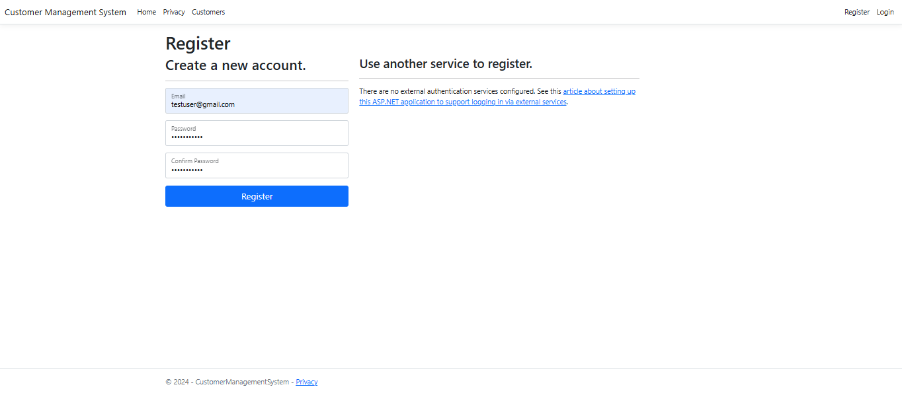

3. **Login to your account**
   - Use your credentials to log in

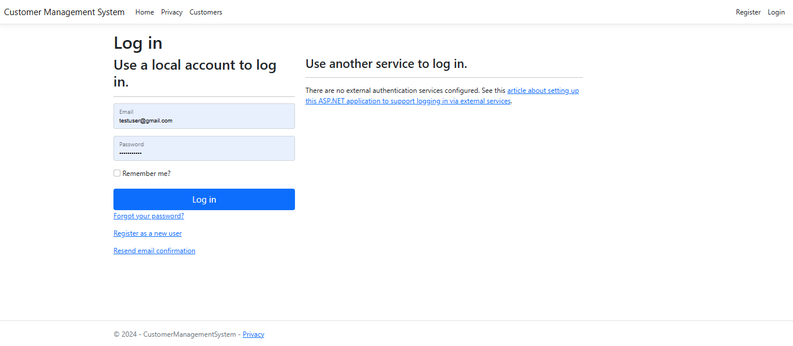

### Customer Management

#### Viewing Customers
- Navigate to the "Customers" section
- Browse through the customer list

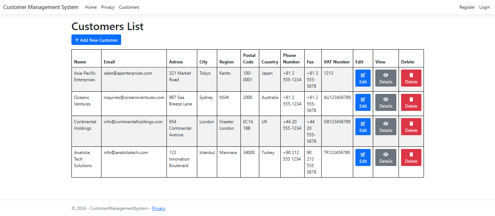

#### Adding New Customers
1. Click "Add New Customer"
2. Fill in all required customer information
3. Click "Create" to save

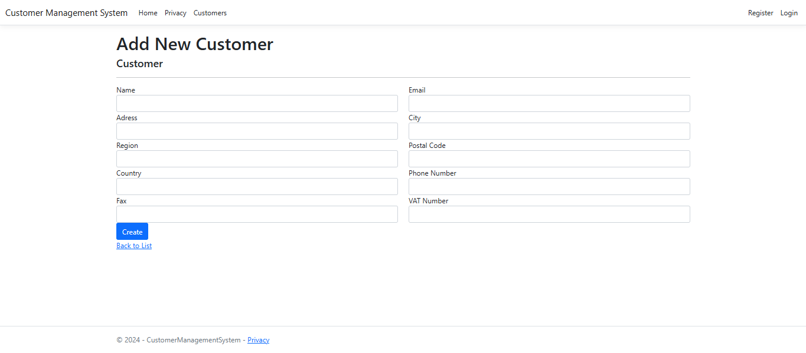

#### Viewing Customer Details
- Click "Details" next to any customer to view complete information

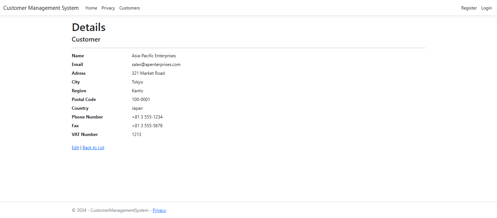

#### Editing Customers
1. Click "Edit" next to the customer you want to modify
2. Update the necessary information
3. Click "Save" to apply changes

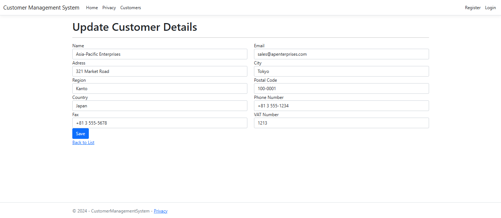

#### Deleting Customers
1. Click "Delete" next to the customer
2. Confirm the deletion in the confirmation dialog

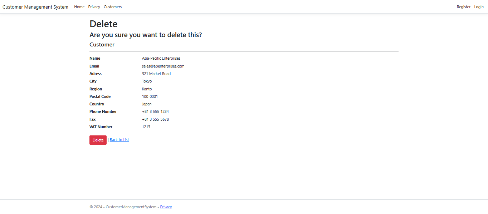

### User Profile Management

#### Manage Profile
- Access your profile settings from the user menu

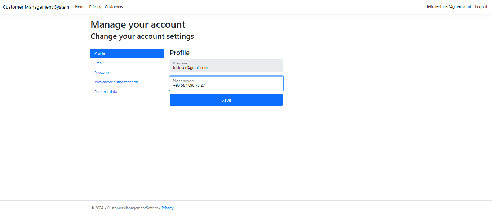

#### Email Management
- Update your email address and confirmation status

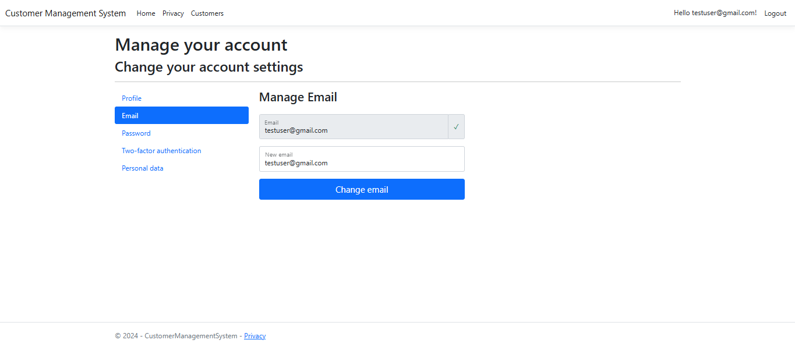

#### Password Reset
- Reset your password if needed

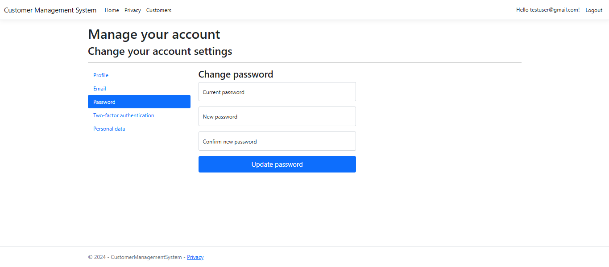

#### Personal Data Management
- Download your personal data as JSON
- Delete your account if required (GDPR compliance)

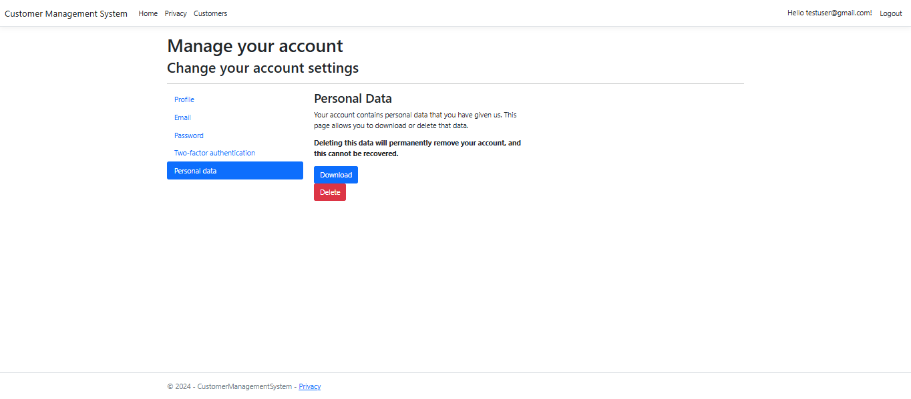
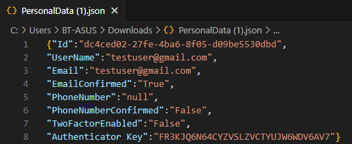
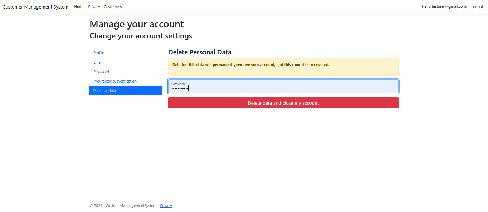

## 🔌 API Endpoints

### Customer Controller
| Method | Endpoint | Description |
|--------|----------|-------------|
| GET | `/Customers` | List all customers |
| GET | `/Customers/Details/{id}` | Get customer details |
| GET | `/Customers/Create` | Show create customer form |
| POST | `/Customers/Create` | Create new customer |
| GET | `/Customers/Edit/{id}` | Show edit customer form |
| POST | `/Customers/Edit/{id}` | Update customer |
| GET | `/Customers/Delete/{id}` | Show delete confirmation |
| POST | `/Customers/Delete/{id}` | Delete customer |

### Home Controller
| Method | Endpoint | Description |
|--------|----------|-------------|
| GET | `/` | Home page |
| GET | `/Home/Privacy` | Privacy policy page |

## 🔒 Security Features

- **Input Validation:** All user inputs are validated both client-side and server-side
- **SQL Injection Protection:** Entity Framework provides built-in protection
- **XSS Protection:** Razor views automatically encode output
- **CSRF Protection:** Anti-forgery tokens are used in forms
- **Authentication:** Secure user authentication system
- **Authorization:** Role-based access control

## 🎨 UI/UX Features

- **Responsive Design:** Works seamlessly on desktop, tablet, and mobile devices
- **Bootstrap Integration:** Modern and consistent styling
- **Font Awesome Icons:** Enhanced visual experience
- **Form Validation:** Real-time client-side validation with jQuery
- **Error Handling:** User-friendly error messages and pages
- **Loading States:** Visual feedback for user actions

## 🧪 Testing

### Running Tests
```bash
dotnet test
```

### Test Coverage
The application includes:
- Unit tests for business logic
- Integration tests for controllers
- Database tests for data access layer

## 📊 Performance Considerations

- **Entity Framework Optimization:** Efficient queries and change tracking
- **Caching:** Strategic caching of frequently accessed data
- **Lazy Loading:** Optimized data loading strategies
- **Pagination:** Large datasets are paginated for better performance

## 🔄 Future Enhancements

- [ ] Advanced search and filtering capabilities
- [ ] Customer import/export functionality (CSV, Excel)
- [ ] Customer categorization and tagging
- [ ] Customer interaction history tracking
- [ ] Dashboard with analytics and reports
- [ ] API endpoints for mobile applications
- [ ] Multi-language support
- [ ] Advanced user roles and permissions

## 🤝 Contributing

1. Fork the repository
2. Create a feature branch (`git checkout -b feature/AmazingFeature`)
3. Commit your changes (`git commit -m 'Add some AmazingFeature'`)
4. Push to the branch (`git push origin feature/AmazingFeature`)
5. Open a Pull Request

### Development Guidelines
- Follow ASP.NET Core best practices
- Write unit tests for new features
- Update documentation for any changes
- Use meaningful commit messages

## 📄 License

This project is licensed under the MIT License - see the [LICENSE](LICENSE) file for details.

## 📞 Support

For support and questions:
- Create an issue in the GitHub repository
- Email: [your-email@example.com]
- Documentation: [Project Wiki](https://github.com/yourusername/CustomerManagementSystem/wiki)

## 🙏 Acknowledgments

- ASP.NET Core team for the excellent framework
- Entity Framework team for the robust ORM
- Bootstrap team for the responsive CSS framework
- Font Awesome for the beautiful icons
- jQuery team for client-side functionality

---

**Built with ❤️ using ASP.NET Core MVC**
